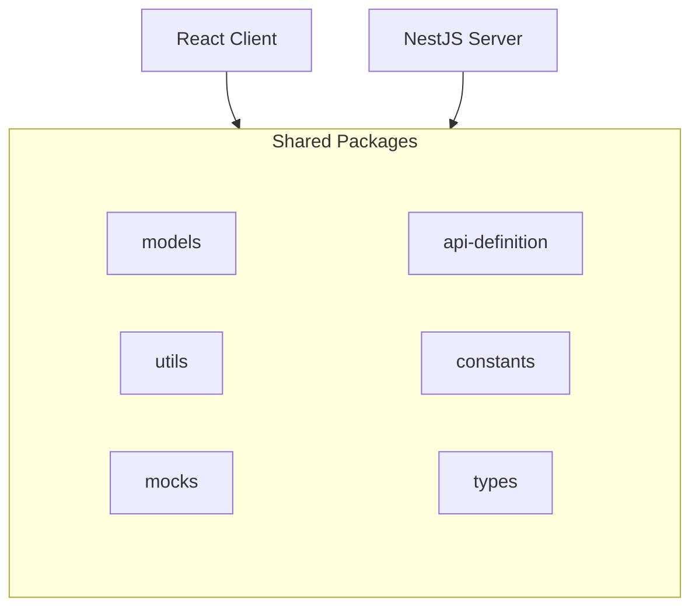

# 🏗️ Architecture Overview

## 🖼️ Diagram

```mermaid
graph TB
    Client[React Client]
    Server[NestJS Server]
    
    subgraph Shared["Shared Packages"]
        direction TB
        subgraph row1[" "]
            API[api-definition]
            Constants[constants]
            Types[types]
        end
        subgraph row2[" "]
            Models[models]
            Utils[utils]
            Mocks[mocks]
        end
    end
    
    Client --> Shared
    Server --> Shared
    
    style row1 fill:transparent,stroke:none
    style row2 fill:transparent,stroke:none
```
